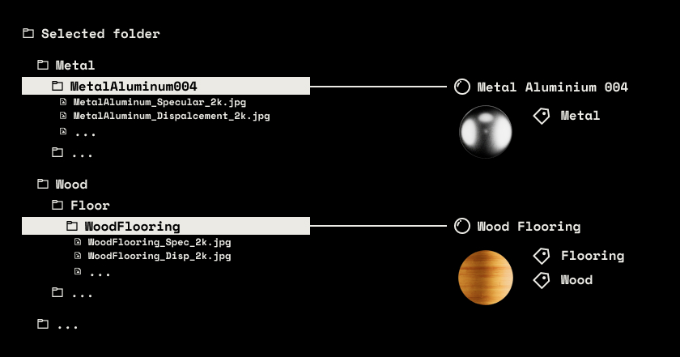
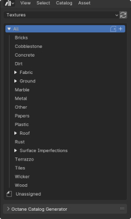
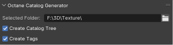
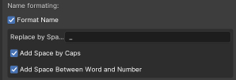
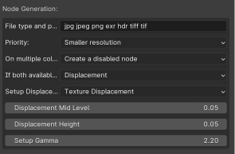
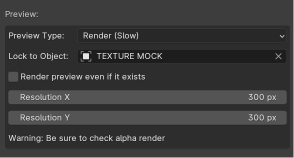

# Blender Octane Library Generator
For Blender 4.0.0 Octane version

## Introduction

This addon is specifically designed for Blender with Octane Render. It enables users to generate a vast number of materials quickly and efficiently, placing them directly into the asset library. Moreover, it provides options to simulate Blender's preview feature found in Cycles and Eevee through rendered previews. Equipped with a wide range of customizable settings, it can adapt to any workflow and can also be utilized in a manner similar to a node wrangler addon.

## How It Works

The addon traverses all subdirectories, replicating the existing folder structure within the asset browser. The name of the subfolder containing textures determines the name of the material.

**IMPORTANT**: Reload the asset browser after running to see the catalog structure.

If the selected folder already includes textures, the material will inherit the folder's name and be categorized under "Unassigned".

Users have the flexibility to generate materials based on their preferences and routines. It is possible to generate a preview for each material. Furthermore, a list of keywords can be defined for each material type, ensuring compatibility with every library type.

**IMPORTANT**: Before initiating the material generation process, ensure that the Octane Server is running to avoid prolonged generation times.

### 1. Tagging and Hierarchy

Optionally, you can generate the folder hierarchy and assign tags to each material based on the directory structure where the textures are located. For instance, textures stored in `Fabric/Rug/RugLuma_001` would be tagged with `Fabric` and `Rug`.

### 2. Name Formatting

Those settings allow for enhancing the appearance of text names.

### 3. Node Generation

- **File Type and Priority**: Specifies the accepted file formats and their order of priority.
- **Priority**: Selects the file type to prioritize during material generation.
- **On Multiple Color Maps**: Addresses scenarios where materials come with several albedo/color textures, providing options to generate a material for each texture, add a disabled node in the shader, or select only the first or last texture based on its name.
- **If Both Available, Use**: Determines whether to link displacement or bump maps, or both if both are available.
- **Setup Displacement**: Specifies the type of displacement to use if a displacement map is present, choosing between texture or vertex displacement.
- All other parameters are tailored for node generation.

### 4. Preview Options

Multiple preview options are available:
- **No Preview**: Does not generate any preview upon material creation.
- **Use Color Map**: Utilizes the linked albedo image as a preview, offering the quickest option.
- **Render**: Generates a rendered image for each material, significantly extending the generation process.

#### Preview Render

Choosing to render previews will save them as `preview.png` in each material's folder. It is recommended to prepare a Blender mockup file with the desired lighting setup for the previews. An object must be selected for texture application.

Changes to the setup can be accommodated by opting to re-render the preview, which will overwrite the existing `preview.png`. The preview resolution can be adjusted in pixels, with all other settings derived from your scene configuration.

### 5. Texture Naming Conventions

This feature allows the specification of keys for each texture node generation, linking them to the universal material. Nodes for emission and displacement are automatically generated as needed. The addon automatically multiplies ambient occlusion with albedo if both are present.

An algorithm identifies whether a term is a key, for example, `metal_stainless_col_4k_metalness.jpg` is classified as an albedo instead of a metallic texture based on the naming convention `metal_stainless_[key]_4k_metalness`.

## Performance

Several settings are available to adjust the generation time. Generating all previews without pre-imported textures takes approximately 5 minutes for around 200 materials.

